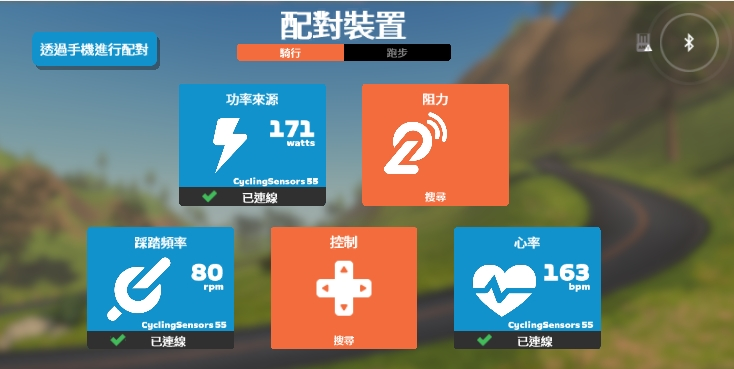
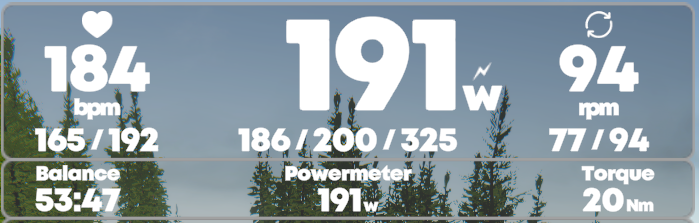
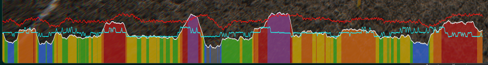

# 骑行台传感器模拟器

模拟骑行台传感器数据，并通过蓝牙发送到zwift等骑行软件

## 已实现的传感器和数据项

- 功率计
  - 功率
  - 踏频
  - 左右平衡
  - 扭矩
- 心率计
  - 心率
- 踏频速度计
  - 踏频
- 电池
  - 电量等级

## 设备依赖

### 1. 蓝牙设备
需要有一个usb 蓝牙设备, 并安装WinUsb蓝牙驱动, win默认驱动不支持
* 迈金骑行台自带蓝牙接收器测试通过
* 主板自带wifi/蓝牙芯片 如 AX200 测试无法安装驱动

#### 1.1 安装驱动
* https://github.com/pbatard/libwdi/releases
  * 下载 `zadig-2.8.exe`
  * 选择对应设备, 如迈金接收器为 `CSR8510 A10`, 将 `Driver` 切换为 WinUSB
  * 更多参考: https://github.com/pbatard/libwdi/wiki/Zadig

## 环境依赖
- Python 3.9
  - 因依赖的 google/bumble 编译问题, 不支持 3.9 以上版本
- Visual Studio 2022
  - 工作负荷 -> 使用C++的桌面开发
- google/bumble 0.0.180
  - `git clone https://github.com/google/bumble.git`
  - `python -m pip install -e ./bumble`

